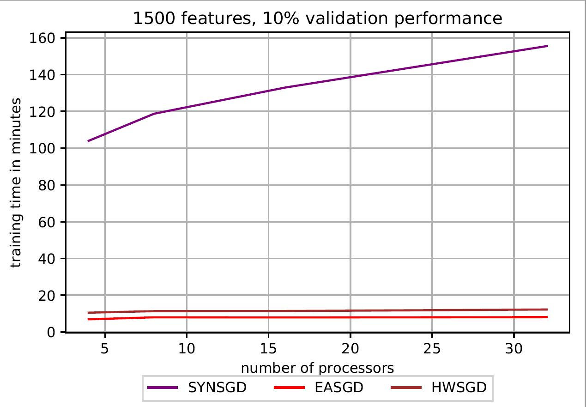

# Scaling up Stochastic Gradient Descent using Data Parallelism
## This work is copyrighted. 

Authors:  
Ramya Rao Basava and Ganesh Jawahar  
Department of Computer Science,  
University of British Columbia.
 
 
Guide:  
Prof. Alan Wagner
 

## Introduction

 
In this project, the winner of the Hong Kong Horse Racing is predicted using Machine Learning (ML). In addition to the standard horse and race features, the most frequent words from the match summary for each race are also used as input features. Least squares regression with L2 regularization is used. Given that this is a parallel computing project, apart from trying to get a good accuracy for the ML problem, one of the main aims of the project was to reduce the computation time by parallelizing the Stochastic Gradient Descent (SGD) step. For this, three
different approaches were compared as listed below:
* Synchronous SGD
* Elastic Averaging based Asynchronous SGD
* HOGWILD based Asynchronous SGD (based on distributed memory, not shared memory)

The overview of the communication structure for the different methods, data processing, the hyperparameters used for different algorithms, MPI parallel environment calls and the results obtained are given in <a href="Report/main.pdf" target="blank">this pdf</a>.

 
Dependencies: 
[1] C  
[2] MPICH  
[3] Python  
[4] [scikit-learn](https://scikit-learn.org/stable/)  
[5] [xlrd](https://pypi.org/project/xlrd/)  
Last three dependencies are required for preprocessing the data.
 
 
Resources:  
[1] [Hong Kong Horse Racing Dataset](https://www.kaggle.com/alberthkcheng/hong-kong-horse-racing-explained-with-data)

## How to run?

### Step-1: Preprocess the data and create train, validation and test splits

Sample run: python preprocess_data.py all 1000  
Format: python preprocess_data.py &ltfeatures&gt &ltvocabsize&gt  
where,    

 

&lt features &gt:
<ul style="list-style-type:disc;"> 
  <li>correspond to the feature we need to include for the ML task </li>
  <li>specifying "all" will include all the 13 features (horse + race features) along with features from summary </li>
  <li>specifying "horse_number, jockey, trainer" will include the specified three features along with features from summary. </li>
</ul>

 

&ltvocabsize&gt:
<ul style="list-style-type:disc;">
  <li>correspond to the top <int> words to include as features from summary. </li>
</ul> 

 

### Step-2a: Start training for Synchronous SGD (SYNSGD)

mpicc -o main *.c  
mpiexec -n 4 ./main 1 10    
  
The above command starts the training with 4 processors, using SYNSGD algorithm which has input code of 1 and training halts once validation accuracy of current iteration reaches 10%.

### Step-2b: Start training for Elastic Averaging based Asynchronous SGD (EASGD)

mpicc -o main *.c  
mpiexec -n 4 ./main 2 10    
  
The above command starts the training with 4 processors, using EASGD algorithm which has input code of 2 and training halts once validation accuracy of current iteration reaches 10%.

### Step-2c: Start training for HOGWILD based Asynchronous SGD (HWSGD)

mpicc -o main *.c  
mpiexec -n 4 ./main 3 10    
  
The above command starts the training with 4 processors, using HWSGD algorithm which has input code of 3 and training halts once validation accuracy of current iteration reaches 10%.

### Misc:

[1] If you want to change hyperparameters of the parallel algorithm or ML algorithm, look at input_variables.c

